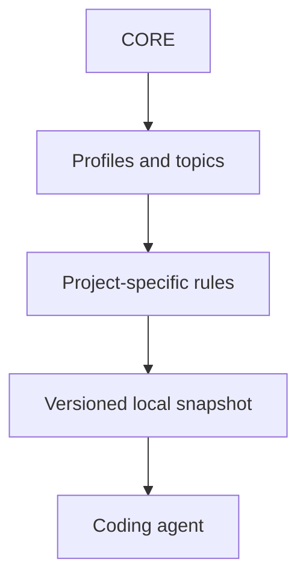

# AI Rules Hub

AI Rules Hub is a local tool for giving coding agents consistent rules across repositories while each project keeps its own instructions and exceptions.

Without one source, the same instruction is copied into several projects and later drifts. The hub keeps shared rules in one place, lets an agent choose only the relevant set, shows every planned file change, and updates only the files it manages.

The hub is not a hosted service. After an update, the project keeps a local copy of the selected rules and does not need the hub while an agent is working.

## What it changes

The hub installs a versioned snapshot under `.ai-rules/upstream/` and records it in `.ai-rules/lock.json`. It may create missing local entry files during first setup, but it never replaces existing project-owned instructions.

It does not change application code, dependencies, CI, repository settings, Git history, or remote services. It never runs `git pull`, commits, pushes, resolves conflicts, or deletes deselected files automatically.

## Start with your coding agent

Clone the hub, check it, and generate a project-specific prompt:

```powershell
git clone https://github.com/Dmitryaf/ai-rules-hub.git
Set-Location ai-rules-hub
.\ai-rules.ps1 doctor
.\ai-rules.ps1 prompt connect -ProjectRoot C:\path\to\project
```

Paste the output into a coding agent running in the target project. The agent will:

1. inspect the project without changing it;
2. recommend the smallest relevant rule set in plain language;
3. prepare local routing and show the synchronization Plan;
4. stop before `-Apply` for your approval;
5. apply the reviewed Plan, run `doctor`, show `status`, and inspect the project diff.

The agent is explicitly told not to fix unrelated project gaps, commit, push, publish, delete, or rewrite history.

## Manual quick start

If you already know the profile you need, one command prepares the project and shows the first Plan:

```powershell
.\ai-rules.ps1 connect `
  -ProjectRoot C:\path\to\project `
  -Profiles standard-product
```

Review the paths and revision, then repeat the same command with `-Apply`:

```powershell
.\ai-rules.ps1 connect `
  -ProjectRoot C:\path\to\project `
  -Profiles standard-product `
  -Apply
```

The first command may create missing project-owned starter files, but managed rules are not installed until explicit `-Apply`. The apply command automatically runs connection verification and prints the final synchronization state.

## How it works



Each project selects project types (`profiles`) and work areas (`topics`) in a manifest. The hub compares that selection with the installed copy and shows which files it would add, update, keep, or leave for manual review.

```text
Plan → Review → Apply → Verify
```

- **Plan** shows `add`, `update`, `unchanged`, `conflict`, and `orphan` states without changing files.
- **Review** shows the selected Git revision and every affected path before an update.
- **Apply** updates only the managed copy and stops if one of those files was changed locally.
- **Verify** checks file structure, revision data, required routes, and file hashes.

## Safety guarantees

- Each installed rule set points to a full Git commit SHA.
- The generated lock records the final selection and SHA-256 of every managed file.
- Running the same update twice with the same source and manifest produces no extra changes.
- Preview is the default; changing files requires an explicit `-Apply` flag.
- The tool owns only `.ai-rules/upstream/` and `.ai-rules/lock.json` in a target project.
- Project-owned `AGENTS.md`, `RULESET.md`, `PROJECT_RULES.md`, and manifest files are not overwritten during updates.
- Locally changed managed files become conflicts and remain untouched.
- Rules removed from the selection are reported as `orphan` files and are not deleted automatically.
- Path validation keeps generated targets inside the managed directory.
- The CLI reports whether the hub checkout is newer, older, unrelated, or unavailable instead of treating every different SHA as an update.

## Status

AI Rules Hub is an early-stage public project. Automated tests cover the CLI and local file updates, but there is no stable release or compatibility promise yet. The verified workflow currently runs on Windows.

## Requirements

- Git;
- Windows;
- Windows PowerShell 5.1 or PowerShell 7+ with `powershell.exe` available.

No package manager or runtime dependency is required for normal use. Run the commands below from the root of the hub checkout; `-ProjectRoot` always points to the target project.

## Rule model

### CORE

[`rules/CORE.md`](rules/CORE.md) contains the short baseline used in almost every project: read relevant context, keep changes within scope, preserve unknown values, verify the result, use plain language, and leave irreversible actions under owner control.

### Topics

[`rules/`](rules/README.md) contains separate guidance for product work, architecture and data, implementation, quality, operations, security, documentation, Git delivery, AI collaboration, research, and project study. An agent reads only the files needed for the current task.

### Profiles

[`profiles/`](profiles/README.md) group topics for common project types and add rules specific to that type. A project can select more than one profile.

Common examples:

| Project type | Suggested profiles |
| --- | --- |
| User-facing application | `standard-product` |
| Learning application | `standard-product + learning-project` |
| Public application | `standard-product + public-repository` |
| Application with sensitive data | `standard-product + data-sensitive` |
| Research prototype | `research-driven` |
| Research-dependent product | `standard-product + research-driven` |

Topics can be selected independently for additional work classes, such as `reliability-and-operations`.

### Project-owned rules

The target repository owns its local routing and exceptions:

```text
AGENTS.md
└── .ai-rules/
    ├── manifest.json
    ├── lock.json
    ├── RULESET.md
    ├── PROJECT_RULES.md
    └── upstream/
        ├── CORE.md
        ├── profiles/
        └── rules/
```

`RULESET.md` explains the selected composition and explicit exceptions. `PROJECT_RULES.md` contains only durable project-specific constraints and documentation routes. The synchronization tool manages `upstream/` and `lock.json`; the remaining files belong to the project.

## Detailed connection workflow

The agent-assisted prompt above is the recommended entry point. For direct CLI control:

1. Inspect the available profiles and topics if needed:

   ```powershell
   .\ai-rules.ps1 list profiles
   .\ai-rules.ps1 list topics
   ```

2. Prepare the local layer and preview managed changes:

   ```powershell
   .\ai-rules.ps1 connect `
     -ProjectRoot C:\path\to\project `
     -Profiles standard-product `
     -Topics security-and-privacy
   ```

3. Apply exactly the reviewed selection:

   ```powershell
   .\ai-rules.ps1 connect `
     -ProjectRoot C:\path\to\project `
     -Profiles standard-product `
     -Topics security-and-privacy `
     -Apply
   ```

   The command applies the clean hub revision, then runs `doctor` and `status` automatically.

4. For a deeper initial compliance review, generate the separate audit prompt:

   ```powershell
   .\ai-rules.ps1 prompt audit
   ```

   The prompt is also available in [`templates/PROJECT_AUDIT_PROMPT.md`](templates/PROJECT_AUDIT_PROMPT.md). It completes the local rules layer first, then audits the rest of the project without changing it.
   Shared rules do not need to be copied manually.

The manifest intentionally remains unpinned until the first reviewed Apply. Existing `AGENTS.md`, `RULESET.md`, and `PROJECT_RULES.md` files are skipped rather than replaced. For an already initialized project, `connect` shows the current update Plan; optional selection arguments must exactly match its manifest.

Detected project gaps are audit results, not permission to change unrelated code, documentation, CI, licensing, or repository settings.

## Inspect an installation

```powershell
.\ai-rules.ps1 doctor -ProjectRoot C:\path\to\project
.\ai-rules.ps1 status -ProjectRoot C:\path\to\project
.\ai-rules.ps1 plan -ProjectRoot C:\path\to\project
```

- `doctor` checks connection integrity, JSON, revision metadata, routes, placeholders, and managed hashes. A successful result does not prove that the entire project complies with every selected rule.
- `status` reports the selected and effective composition, synchronization state, and next command.
- `plan` evaluates the revision already pinned in the manifest. For an unpinned manifest, it remains a preliminary preview.

| State | Meaning |
| --- | --- |
| `not-initialized` | The project has not been connected |
| `unpinned` | Local files exist but no revision is pinned |
| `synchronized` | The project matches the current hub checkout |
| `update-available` | The checkout is a confirmed newer Git ancestor |
| `checkout-older` | The checkout is older than the project revision |
| `checkout-diverged` | The histories have diverged |
| `checkout-mismatch` | The relation cannot be established |
| `inconsistent` | The installation is incomplete or damaged |

## Update a project snapshot

Preview a transition to the current checkout:

```powershell
.\ai-rules.ps1 update -ProjectRoot C:\path\to\project
```

Apply it after review:

```powershell
.\ai-rules.ps1 update -ProjectRoot C:\path\to\project -Apply
```

`update -Apply` requires a clean hub checkout and records its full commit SHA. To reapply an already pinned revision, use:

```powershell
.\ai-rules.ps1 apply -ProjectRoot C:\path\to\project
```

The preview may run from a dirty hub checkout, but it explicitly warns that the result reflects working files rather than only `HEAD`. That preview cannot be applied until the hub is clean and the plan is reviewed again.

## Change the selected composition

There is no `configure` command yet. Change the selection explicitly:

1. edit `profiles` and `topics` in `.ai-rules/manifest.json`;
2. update the human-readable reasons and exceptions in `.ai-rules/RULESET.md`;
3. run `doctor` and `plan`;
4. review `add`, `update`, `conflict`, and `orphan` states;
5. run `apply` for the pinned revision, or `update -Apply` for a reviewed transition;
6. inspect the project diff.

Orphan files are retained for manual review. Locally changed managed files are never silently overwritten.

## Get a newer hub revision

Git updates the hub checkout; the CLI transfers an explicitly selected revision into a project. These are separate actions:

```powershell
git status --short
git pull --ff-only
.\ai-rules.ps1 doctor
.\ai-rules.ps1 update -ProjectRoot C:\path\to\project
.\ai-rules.ps1 update -ProjectRoot C:\path\to\project -Apply
```

The CLI does not run `git pull` or `git fetch` automatically.

## Synchronization states

| Action | Meaning | Default response |
| --- | --- | --- |
| `add` | A selected managed file is missing | Review the intended selection |
| `update` | The source changed and the target still matches its previous lock hash | Review the new content |
| `unchanged` | Source and target match | No action |
| `conflict` | A managed file changed locally or appeared without lock ownership | Resolve manually before Apply |
| `orphan` | A clean managed file is no longer selected | Review links; automatic deletion is disabled |
| `orphan-modified` | A deselected file also has local changes | Preserve and resolve it manually |
| `orphan-missing` | A deselected file is already absent | Verify the expected composition |

The low-level synchronization contract is documented in [`sync/README.md`](sync/README.md).

## Repository structure

```text
AGENTS.md       rules for working on this repository
rules/          portable baseline and topic rules
profiles/       reusable topic compositions
templates/      project-owned starter documents
hub/            product and architecture rules for this repository
sync/           catalog and synchronization contract
scripts/        initializer, synchronization, and validation tools
tests/          autonomous tooling tests
```

Before changing the hub, read [`AGENTS.md`](AGENTS.md), [`rules/CORE.md`](rules/CORE.md), [`hub/PROJECT_RULES.md`](hub/PROJECT_RULES.md), [`hub/ARCHITECTURE.md`](hub/ARCHITECTURE.md), and [`hub/COMMIT_RULES.md`](hub/COMMIT_RULES.md).

Run the repository checks with:

```powershell
powershell.exe -NoProfile -ExecutionPolicy Bypass -File scripts/check-hub.ps1
powershell.exe -NoProfile -ExecutionPolicy Bypass -File tests/test-tooling.ps1
git diff --check
git status --short
```

## Current limitations

- No remote rule download through the CLI.
- No bulk update across projects.
- No automatic conflict merge or orphan deletion.
- No silent migration from the legacy root manifest/lock format.
- The verified execution contract is currently limited to Windows.

## Contributing, security, and license

See [`CONTRIBUTING.md`](CONTRIBUTING.md) before proposing a change. Report vulnerabilities through the [security policy](.github/SECURITY.md); do not publish secrets or private project context in issues, pull requests, or comments.

AI Rules Hub is available under the [MIT License](LICENSE).
