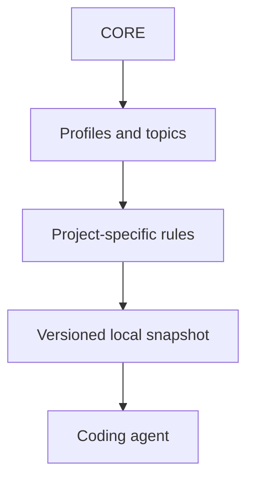

# AI Rules Hub

AI Rules Hub applies versioned, reusable coding-agent guidance to different repositories without replacing each project's own rules.

Coding-agent instructions often drift between projects, grow into duplicated documents, or overwrite local constraints during updates. This repository separates shared rules from project-owned decisions and provides an explicit synchronization workflow that can be reviewed before it changes a target repository.

The hub is a local tool, not a hosted service. After synchronization, the target project keeps an autonomous snapshot and does not need the hub at runtime.

## How it works



Each target repository chooses profiles and topics in a manifest. The hub resolves that selection, compares it with the installed snapshot, and reports the actions it would take.

```text
Plan → Review → Apply → Verify
```

- **Plan** calculates `add`, `update`, `unchanged`, `conflict`, and `orphan` states without writing files.
- **Review** keeps the selected revision and every affected path visible before mutation.
- **Apply** updates only the managed snapshot and stops on locally modified managed files.
- **Verify** checks structure, revision metadata, routes, and content hashes.

## Engineering highlights

- Rulesets are pinned to a full Git commit SHA.
- The generated lock records the resolved composition and normalized SHA-256 for every managed file.
- Synchronization is deterministic and idempotent for an unchanged source and manifest.
- Preview is the default; mutation requires an explicit `-Apply` flag.
- The tool owns only `.ai-rules/upstream/` and `.ai-rules/lock.json` in a target project.
- Project-owned `AGENTS.md`, `RULESET.md`, `PROJECT_RULES.md`, and manifest files are not overwritten during updates.
- Locally changed managed files become conflicts and remain untouched.
- Removed selections become visible orphan states and are not deleted automatically.
- Path validation keeps generated targets inside the managed directory.
- The CLI distinguishes newer, older, diverged, and unavailable Git revisions instead of treating every SHA mismatch as an update.

## Status

AI Rules Hub is an early-stage public project. The CLI and local synchronization model have an autonomous test suite, but no stable release or compatibility guarantee has been announced. The currently verified workflow is Windows-based.

## Requirements

- Git;
- Windows;
- Windows PowerShell 5.1 or PowerShell 7+ with `powershell.exe` available.

No package manager or runtime dependency is required for normal use. Run the commands below from the root of the hub checkout; `-ProjectRoot` always points to the target project.

## Quick start

```powershell
git clone https://github.com/Dmitryaf/ai-rules-hub.git
Set-Location ai-rules-hub
.\ai-rules.ps1 doctor
.\ai-rules.ps1 init `
  -ProjectRoot C:\path\to\project `
  -Profiles standard-product
.\ai-rules.ps1 update -ProjectRoot C:\path\to\project
.\ai-rules.ps1 update -ProjectRoot C:\path\to\project -Apply
.\ai-rules.ps1 doctor -ProjectRoot C:\path\to\project
.\ai-rules.ps1 status -ProjectRoot C:\path\to\project
```

`init` prepares project-owned files but does not create a lock, install the managed snapshot, or overwrite an existing local rules entry point. The first `update` is a preview; `update -Apply` performs the reviewed transition to the current clean hub revision.

## Rule model

### CORE

[`rules/CORE.md`](rules/CORE.md) contains the small baseline that applies almost everywhere: relevant context, truthful evidence, bounded changes, preservation of unknown values, proportional verification, plain language, and owner control over irreversible actions.

### Topics

[`rules/`](rules/README.md) contains focused guidance for product work, architecture and data, implementation, quality, operations, security, documentation, Git delivery, AI collaboration, research, and project study. An agent reads only the topics relevant to the current task.

### Profiles

[`profiles/`](profiles/README.md) compose topics for recurring project types and add only obligations specific to that type. A project can combine profiles; this is composition, not inheritance.

Common examples:

| Project type | Suggested profiles |
| --- | --- |
| User-facing application | `standard-product` |
| Learning application | `standard-product + learning-project` |
| Public application | `standard-product + public-repository` |
| Application with sensitive data | `standard-product + data-sensitive` |
| Research prototype | `research-driven` |
| Research-dependent product | `standard-product + research-driven` |

Topics can be selected independently for additional work classes, such as `reliability-and-operations`.

### Project-owned rules

The target repository owns its local routing and exceptions:

```text
AGENTS.md
└── .ai-rules/
    ├── manifest.json
    ├── lock.json
    ├── RULESET.md
    ├── PROJECT_RULES.md
    └── upstream/
        ├── CORE.md
        ├── profiles/
        └── rules/
```

`RULESET.md` explains the selected composition and explicit exceptions. `PROJECT_RULES.md` contains only durable project-specific constraints and documentation routes. The synchronization tool manages `upstream/` and `lock.json`; the remaining files belong to the project.

## Connect a new project

1. Inspect the available profiles and topics:

   ```powershell
   .\ai-rules.ps1 list profiles
   .\ai-rules.ps1 list topics
   ```

2. Initialize the local rules layer:

   ```powershell
   .\ai-rules.ps1 init `
     -ProjectRoot C:\path\to\project `
     -Profiles standard-product `
     -Topics security-and-privacy
   ```

3. Preview and apply the current hub revision:

   ```powershell
   .\ai-rules.ps1 update -ProjectRoot C:\path\to\project
   .\ai-rules.ps1 update -ProjectRoot C:\path\to\project -Apply
   ```

4. Generate the project-audit prompt and run it in the target project:

   ```powershell
   .\ai-rules.ps1 prompt audit
   ```

   The prompt is also available in [`templates/PROJECT_AUDIT_PROMPT.md`](templates/PROJECT_AUDIT_PROMPT.md). It completes the local rules layer first, then audits the rest of the project without changing it.
   Shared rules do not need to be copied manually.

5. Verify the installed snapshot:

   ```powershell
   .\ai-rules.ps1 doctor -ProjectRoot C:\path\to\project
   .\ai-rules.ps1 status -ProjectRoot C:\path\to\project
   ```

The manifest intentionally remains unpinned until the first reviewed `update -Apply`. Existing `AGENTS.md`, `RULESET.md`, and `PROJECT_RULES.md` files are skipped rather than replaced.

## Connect an existing project

Use the same workflow, with additional care around current local instructions:

1. Check the target repository's Git status and preserve unrelated changes.
2. Read only enough existing documentation to choose the composition and merge the routing safely.
3. Run `init`; existing project-owned files remain unchanged.
4. Review `status` and the preliminary `update` plan.
5. Run `update -Apply` only after the planned paths and revision are correct.
6. Complete the local rules layer and run the generated audit prompt.
7. Run `doctor` and `status`, then review the target repository diff.

Detected project gaps are audit results, not permission to change unrelated code, documentation, CI, licensing, or repository settings.

## Inspect an installation

```powershell
.\ai-rules.ps1 doctor -ProjectRoot C:\path\to\project
.\ai-rules.ps1 status -ProjectRoot C:\path\to\project
.\ai-rules.ps1 plan -ProjectRoot C:\path\to\project
```

- `doctor` checks connection integrity, JSON, revision metadata, routes, placeholders, and managed hashes. A successful result does not prove that the entire project complies with every selected rule.
- `status` reports the selected and effective composition, synchronization state, and next command.
- `plan` evaluates the revision already pinned in the manifest. For an unpinned manifest, it remains a preliminary preview.

| State | Meaning |
| --- | --- |
| `not-initialized` | The project has not been connected |
| `unpinned` | Local files exist but no revision is pinned |
| `synchronized` | The project matches the current hub checkout |
| `update-available` | The checkout is a confirmed newer Git ancestor |
| `checkout-older` | The checkout is older than the project revision |
| `checkout-diverged` | The histories have diverged |
| `checkout-mismatch` | The relation cannot be established |
| `inconsistent` | The installation is incomplete or damaged |

## Update a project snapshot

Preview a transition to the current checkout:

```powershell
.\ai-rules.ps1 update -ProjectRoot C:\path\to\project
```

Apply it after review:

```powershell
.\ai-rules.ps1 update -ProjectRoot C:\path\to\project -Apply
```

`update -Apply` requires a clean hub checkout and records its full commit SHA. To reapply an already pinned revision, use:

```powershell
.\ai-rules.ps1 apply -ProjectRoot C:\path\to\project
```

The preview may run from a dirty hub checkout, but it explicitly warns that the result reflects working files rather than only `HEAD`. That preview cannot be applied until the hub is clean and the plan is reviewed again.

## Change the selected composition

There is no `configure` command yet. Change the selection explicitly:

1. edit `profiles` and `topics` in `.ai-rules/manifest.json`;
2. update the human-readable reasons and exceptions in `.ai-rules/RULESET.md`;
3. run `doctor` and `plan`;
4. review `add`, `update`, `conflict`, and `orphan` states;
5. run `apply` for the pinned revision, or `update -Apply` for a reviewed transition;
6. inspect the project diff.

Orphan files are retained for manual review. Locally changed managed files are never silently overwritten.

## Get a newer hub revision

Git updates the hub checkout; the CLI transfers an explicitly selected revision into a project. These are separate actions:

```powershell
git status --short
git pull --ff-only
.\ai-rules.ps1 doctor
.\ai-rules.ps1 update -ProjectRoot C:\path\to\project
.\ai-rules.ps1 update -ProjectRoot C:\path\to\project -Apply
```

The CLI does not run `git pull` or `git fetch` automatically.

## Synchronization states

| Action | Meaning | Default response |
| --- | --- | --- |
| `add` | A selected managed file is missing | Review the intended selection |
| `update` | The source changed and the target still matches its previous lock hash | Review the new content |
| `unchanged` | Source and target match | No action |
| `conflict` | A managed file changed locally or appeared without lock ownership | Resolve manually before Apply |
| `orphan` | A clean managed file is no longer selected | Review links; automatic deletion is disabled |
| `orphan-modified` | A deselected file also has local changes | Preserve and resolve it manually |
| `orphan-missing` | A deselected file is already absent | Verify the expected composition |

The low-level synchronization contract is documented in [`sync/README.md`](sync/README.md).

## Repository structure

```text
AGENTS.md       rules for working on this repository
rules/          portable baseline and topic rules
profiles/       reusable topic compositions
templates/      project-owned starter documents
hub/            product and architecture rules for this repository
sync/           catalog and synchronization contract
scripts/        initializer, synchronization, and validation tools
tests/          autonomous tooling tests
```

Before changing the hub, read [`AGENTS.md`](AGENTS.md), [`rules/CORE.md`](rules/CORE.md), [`hub/PROJECT_RULES.md`](hub/PROJECT_RULES.md), [`hub/ARCHITECTURE.md`](hub/ARCHITECTURE.md), and [`hub/COMMIT_RULES.md`](hub/COMMIT_RULES.md).

Run the repository checks with:

```powershell
powershell.exe -NoProfile -ExecutionPolicy Bypass -File scripts/check-hub.ps1
powershell.exe -NoProfile -ExecutionPolicy Bypass -File tests/test-tooling.ps1
git diff --check
git status --short
```

## Current limitations

- No remote rule download through the CLI.
- No bulk update across projects.
- No automatic conflict merge or orphan deletion.
- No silent migration from the legacy root manifest/lock format.
- The verified execution contract is currently limited to Windows.

## Contributing, security, and license

See [`CONTRIBUTING.md`](CONTRIBUTING.md) before proposing a change. Report vulnerabilities through the [security policy](.github/SECURITY.md); do not publish secrets or private project context in issues, pull requests, or comments.

AI Rules Hub is available under the [MIT License](LICENSE).
